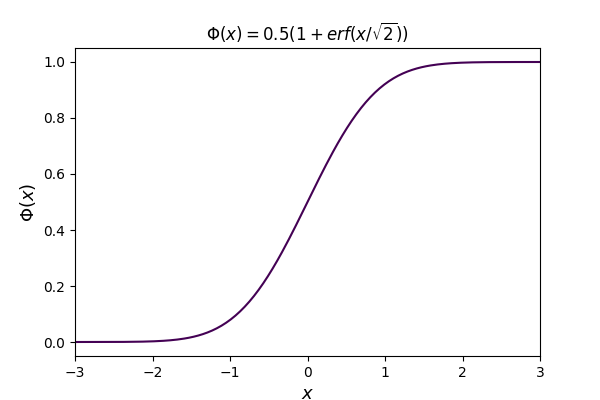
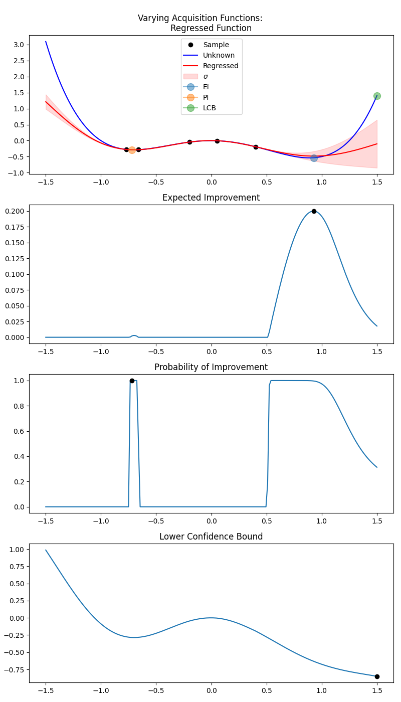

# Bayesian Optimization with Gaussian Processes Part 3 - Bayesian Optimization

Please note that all scripts mentioned below have help string functionality. If you
get stuck with any script run `python -m <package_name>.<module_name> -h` so see the
help string. All commands must be run from the root of the repo.

### The Bayesian Optimization Steps Plot:


Command:

```bash
python -m bayesian_optimisation.bayesian_opt_steps ./steps.png <number_of_sample_points> --xlims -1.5 1.5 --segments 51
```

A good choice for `<number_of_sample_points>` is 5

### Phi Plot:



Command:

```bash
python -m bayesian_optimisation.normal_pmf ./pmf.png --xlims -3 3 --segments 201
```

### Aquisition Functions



Command:

```bash
python -m bayesian_optimisation.acquisition_func_plots ./acquisitions.png <number_of_sample_points>  --xlims -1.5 1.5 --segments 201
```

A good choice for `<number_of_sample_points>` is 5
