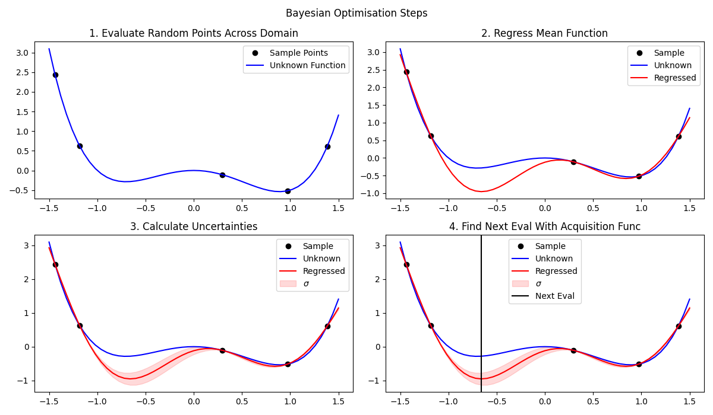
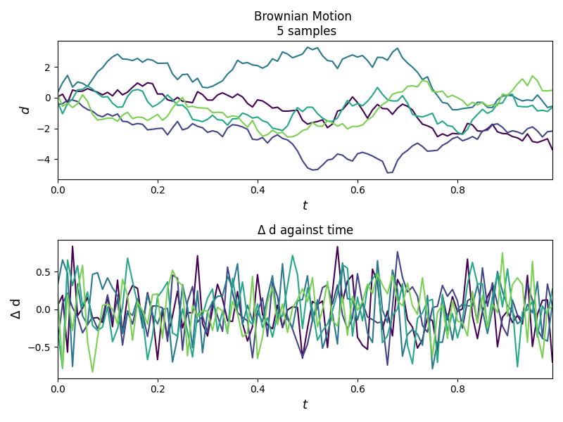
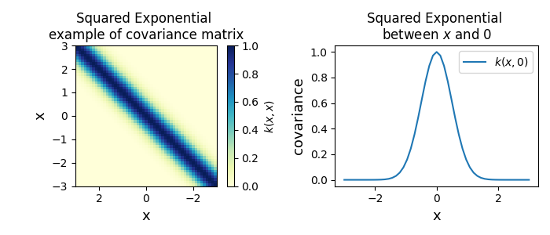
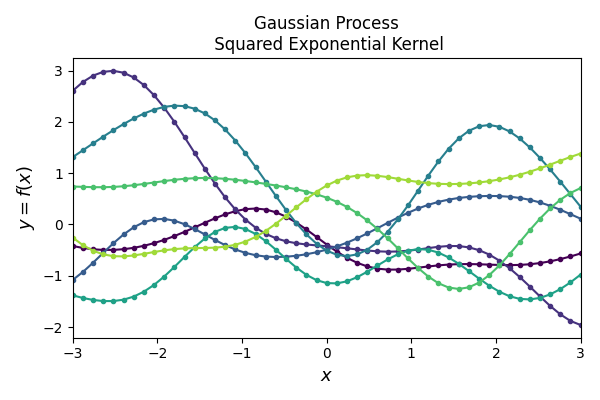
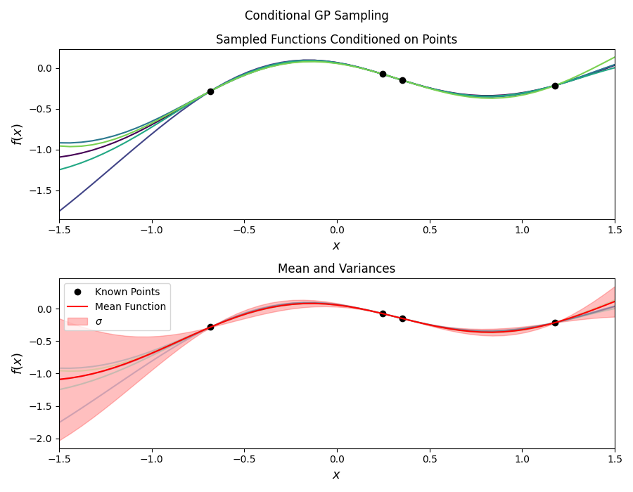

# Bayesian Optimization with Gaussian Processes Part 2 - Gaussian Process Regression

Please note that all scripts mentioned below have help string functionality. If you
get stuck with any script run `python -m <package_name>.<module_name> -h` so see the
help string. All commands must be run from the root of the repo.

### The Bayesian Optimization Steps Plot:



Command:

```bash
python -m bayesian_optimisation.bayesian_opt_steps ./steps.png <number_of_sample_points> --xlims -1.5 1.5 --segments 51
```

A good choice for `<number_of_sample_points>` is 5

### Brownian Motion:


Command:

```bash
python -m gaussian_processes.plot_brownian_motion ./brownian.png --number_of_walks 5 --time_steps 100 --total_time 1.0
```

### Squared Exponential Covariance:


Command:

```bash
python -m gaussian_processes.squared_exponential ./squared_exp.png --x_cut 0 --length_scale 0.5 --xlims -3.0 3.0 --segments 51
```

### Squared Exponential Process:


Command:

```bash
python -m gaussian_processes.gaussian_process /squared_exponential_process.png --func_samples 7 --xlims -3 3 --num_random_vars 51
```

### Gaussian Process Regression:


Command:

```bash
python -m gaussian_processes.gp_regression ./gp_regression.png <number_of_sample_points> --xlims -1.5 1.5 --segments 51
```
A good choice for `<number_of_sample_points>` is 5
