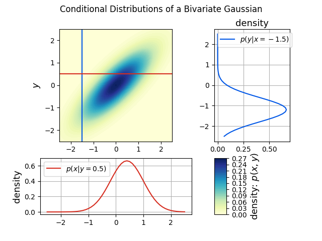

# Bayesian Optimization with Gaussian Processes Part 1 - Multivariate Gaussians

Please note that all scripts mentioned below have help string functionality. If you
get stuck with any script run `python -m <package_name>.<module_name> -h` so see the
help string. All commands must be run from the root of the repo.

### The Bayesian Optimization Steps Plot:


Command:

```bash
python -m bayesian_optimisation.bayesian_opt_steps ./steps.png <number_of_sample_points> --xlims -1.5 1.5 --segments 51
```
Note the substitutions required in the above command

### Multivariates With Varying Covariances


Command:

```bash
python -m multi_variate_gaussians.multivariate ./multi_variate_gaussians/configs/multivariate_gaussians.yaml ./multivariate_gassians.png
```

If you wish to edit the means and covariances please edit the
above config: `./multi_variate_gaussians/configs/multivariate_gaussians.yaml`. Never commit these edits.
Rather copy the config to another location, edit it, point the script to the newly edited copy of the config.

### Marginalized Distributions


Command:

```bash
python -m multi_variate_gaussians.marginalized_multivariate ./multi_variate_gaussians/configs/conditional_gaussian.yaml ./marginalized.png
```

If you wish to edit the means and covariances please edit the
above config: `./multi_variate_gaussians/configs/conditional_gaussian.yaml`. Never commit these edits.
Rather copy the config to another location, edit it, point the script to the newly edited copy of the config.
Note that the script for marginalized plots and conditioned plots use the same config. The conditional values
are just ignored during the generation of the marginalized distributions plot.

### Conditional Distributions



Command:

```bash
python -m multi_variate_gaussians.conditioned_multivariate ./multi_variate_gaussians/configs/conditional_gaussian.yaml ./conditioned.png
```

If you wish to edit the means and covariances please edit the  above config:
`./multi_variate_gaussians/configs/conditional_gaussian.yaml`. Never commit these edits. Rather copy
the config to another location, edit it and point the script to the newly edited copy of the config.
Note that the script for marginalized plots and conditioned plots use the same config. The conditional values
are just ignored during the generation of the marginalized distributions plot.
